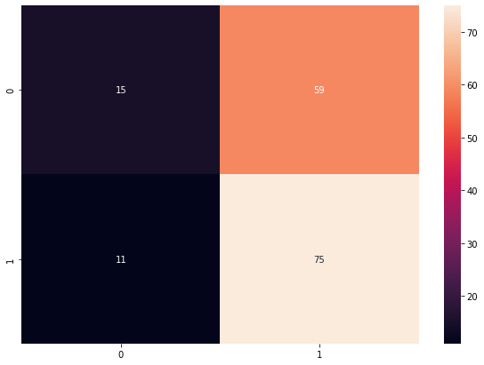

# Serious Apps for Kids

## About serious games and apps

 In this day and age, education through virtual reality has achieved many important milestones that has ensured it a high place in the top of the most used techniques for learning. Certified serious games that have indeed a proven efficiency are scarce and hard to find. Moreover, scientific articles and research on this matter is also very scattered and difficult to locate for any one game. Due to these reasons alone, it has become imperative that a proper search engine is developed, first to filter the most used application stores and discover the serious games, and second to automatically locate any possible scientific evidence related to them.

## Initial Database Filtration

The first step of the project was to define a serious game. The Kaggle database as a base for reflection and determination of the relevant parameters in that database were used for the definition of a serious game. If a parameter was thought to contribute to the selection of serious games, then its threshold was defined.
\
\
This manual selection of the serioud games was assesed by extracting and classifying manually 160 games from the database after filtration (it containes around 800 apps). The results were the following:

  

## Game Characterization

Having the articles, some general information were extracted and the abstract text was used for two types of classification: study type and topic classification. For the first one, the provided dictionary with keywords referring to specific study types was used, while the second classification is based on text preprocessing and using the unsupervised model - \textit{Latent Dirichlet Allocation}. Finally, the last step was to design a dashboard with relevant information in order to provide an easy to use and friendly interface for the user.

### 1. PubMed Article Extraction
In this step the querying of **PubMed** database was done in order to extract publications we consider important for our work. The question is what queries should be used. It is noticed that the games from the database have two parts that can be used for querying together with the whole name. For example, the game *Udemy - Online Courses* can be split into two logical parts *Udemy* and *Online Courses*. Since this was the case for the majority of games we used some splitting signs (such are **-** and **:**) to make a list of queries and use them later for the article extraction. The article extraction from PubMed database is done using the **PyMed** library in Python and the maximum number of articles was set to 10.

### 2. Information Extraction
In the previous process, the algorithm simultaneously extracted the information such are the name of the article, its authors, publication date, doi and keywords. These information were used specifically in the dashboard when representing the selected publication.

### 3. Study type Classification
Not all the studies are the same. The level of clinical evidence depends on the study type. Therefore, it is necessary to classify the extracted papers into the different study types. In this case, we have a multi-classification problem. Given the *StudyTypesDictionaries* file, it was decided to have five classes: Meta Analysis, Observational Study, RCT, Systematic Review and Others. Each class contains specific keywords which occurrences were counted. The result received from the algorithm was presented as a percentage of belonging to one of the aforementioned classes. The class with the highest probability was taken as the final result. 

### 4. Topic Classification
After extracting the articles from PubMed database it was noticed that some of them do not cover our area of interest. For example, articles were about brain development but did not consider neither children nor the games in the amount we expected. Therefore, it was decided to classify the articles according to their content. The unsupervised machine learning model so-called **LDA** was used for the aforementioned problem.

### 5. LDA Model & Data Preparation
Data preparation is a very important step when it comes to fine-tuning the LDA model. The words should be in specific form and some of them that do not contain useful information should be removed. Our preprocessing procedure contains several steps which are listed below. For all of this steps two main Python libraries were used **NLTK** and **Gensim**.

* Splitting abstracts into words
* Removing short and stop words
* Lemmatization - words in third person are changed to first person and verbs in past and future tenses are changed into present
* Stemming - words are reduced to their root form

After obtaining abstracts in a particular form, the corpus and the dictionary were created which were the explicit inputs to the build-in LDA model. Generally, there are three main parameters of the model, but the one that was the most important for this problem is the number of clusters i.e. number of topics. After trying with couple of values, it was concluded that four clusters give the best results. According to the clusters' keyword we named them as in the list below. I need to stress that this topic names were set according to my opinion, but the most important part is having the cluster that is obviously about the games defined as serious. 

* Serious games for kids
* Brain activity analysis
* Health effects on studying
* Health treatment experiments

Each article received the percentage of belonging to one of this four classes and the class with the highest value was assigned to a particular article. 

## Dashboard

The dashboard contains three pages which display the main information about the games and their publications, as well as some general statistics. The first page has the comparison of App Databases before and after filtering, which was done in the firts phase. The result is represented as two pie charts for either the App Category, the App Rating or the Number of Installations. On the right, there is the list of Apps, where they are ranked according to the number of extracted publications. If the user clicks on the name of that game and then on the tab Application, the second page will open.

<table><tr>
<td>  </td>
<td>  </td>
</tr></table>

  

Further details and characteristics of the serious game can be found in the Application page. On the left, under the title of the selected application, the user can find which Learning Category it falls under, the Rating, the Number of publications related to it and the URL that will bring them to the application page in the Online App Store. A comprehensive List of Publications is located in the middle of the page, displaying the titles of all the papers that have been found to be related to the serious game selected. On the right side, there exist two further pie charts – one refers to the game’s publications  study types and underneath, the other is a general statistic of the study types found in total.

If the user clicks on one of the publications in the List of Publications, a new page will open titled PubMed Publication. This page display all of the important information about selected research paper, visualisation of the LDA model results and two bar charts showing the probabilities of belonging to a particular study type and research topic.  
